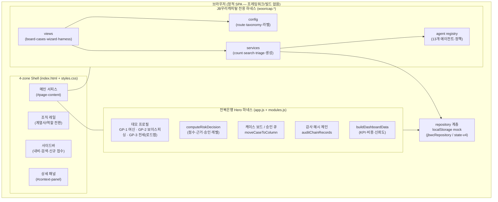
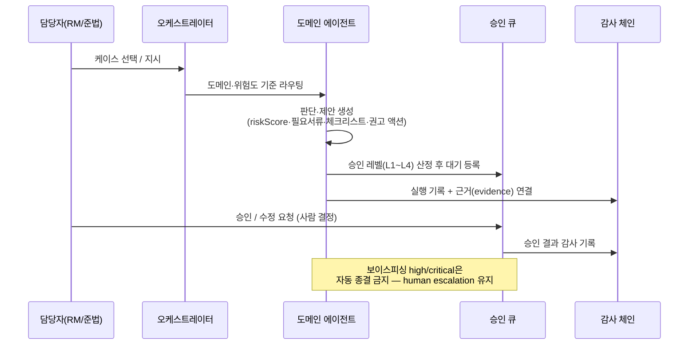

# JB LocalGuard OS — 시스템 아키텍처 설계도

> 담당자 승인 중심(governed) 금융 AI 에이전트 운영 콘솔.
> 슬로건: **"손은 놓고, 눈만"** — 에이전트가 일하고, 담당자는 승인만. AI는 제안하고, 사람은 결정한다.

## 1. 설계 원칙

1. **AI는 최종 결정자가 아니다.** AI는 판단·제안까지만 수행하고, 고객에게 영향이 가는 모든 행동은 담당자(RM/준법) 승인을 거친다.
2. **좁고 강한 실동작.** 실동작 도메인은 여신(소상공인·SME)과 보이스피싱 2개로 한정하고, 나머지는 로드맵 노드로 명시적으로 분리한다.
3. **그룹 확장성.** 전북은행 Hero에서 검증한 운영 패턴(접수 → 분류 → 에이전트 → 사람 승인 → 감사 기록)을 계열사(JB우리캐피탈)에 전용 하네스로 복제 비용 없이 확장한다.
4. **PII 비연결.** 실제 고객 개인정보/신용정보/대출 실행/금융거래는 연결하지 않는다. 화면·저장소에는 익명 참조 ID만 존재한다.
5. **감사 우선.** 모든 에이전트 실행·승인·상태 변경은 해시 체인 감사 로그로 남는다.

## 2. 전체 구성도



- 메인 하네스와 JB우리캐피탈 하네스는 **presentation shell만 공유**하고 business logic·데이터 스코프는 완전히 분리된다(alias 금지, `affiliateId` 강제).
- 저장소는 브라우저 localStorage mock이며, 운영 DB 전환 계약은 [02-은행-DB-연동-설계.md](02-은행-DB-연동-설계.md)에 명문화되어 있다.

## 3. 운영 계약 (도메인 모델)

```
Case → AgentRun → Agent → Skill → Evidence → Approval → Audit
```

| 개체 | 역할 | 프로토타입 구현 |
| --- | --- | --- |
| Case | 위험 신호가 모인 관리 건 | `cases` / `ops_cases` (JBWC) |
| AgentRun | 에이전트 1회 실행 기록 | `agentRuns` / `agent_runs` |
| Agent | 역할·권한·금지행동이 정의된 실행 단위 | `agents`(14) / `jbWooriCapitalAgents`(13) |
| Skill | 에이전트에 장착되는 기능 단위 | `skillRack`(27) |
| Evidence | 판단 근거(출처 칩) | `source-chip` + evidence id |
| Approval | 사람 승인 게이트(L1~L4) | `approvalLevelMatrix`, `approvals` |
| Audit | 해시 체인 감사 기록 | `auditChainRecords`, `audit_logs` |

## 4. 에이전트 하네스 설계

### 4.1 실동작 vs 전시(확장 예정) 분리

- **실동작 5개** (`liveAgentIds`): 업무지원 조율(오케스트레이터) · Cashflow Triage(여신 분류) · Fraud Shield(보이스피싱 대응) · Contract Checklist(문서/체크리스트) · Compliance Guard(감사·승인 통제)
- **확장 예정 9개**: 조직도에 "확장 예정" 배지로 전시만 한다. 얕은 전량 구현은 금지.

### 4.2 요청 처리 흐름 (Hero 데모)



### 4.3 JB우리캐피탈 하네스 (그룹 확장성 증명)

동일한 흐름을 계열사 도메인(개인금융·자동차금융·FDS·소비자보호 등 11개 도메인)에 재사용한다.
상세: [03-JB우리캐피탈-하네스.md](03-JB우리캐피탈-하네스.md)

## 5. 파일 구조

```
app/
  index.html                        # 4-zone shell, 스크립트 로드 순서 정의
  styles.css                        # 디자인 시스템 (Pretendard, 8px radius)
  app.js                            # 메인 하네스 (전북은행 Hero)
  modules.js                        # 보조 레지스트리/패널
  jbWooriCapitalSidebar.config.js   # [JBWC] route/nav/taxonomy/한국어 라벨
  jbWooriCapitalAgents.registry.js  # [JBWC] 에이전트 registry·정책·핸드오프 규칙
  wooricap-db.js                    # [JBWC] mock DB + jbwcRepository 인터페이스
  jbWooriCapitalServices.js         # [JBWC] count/search/triage/생성 서비스
  wooricap.helpers.js               # [JBWC] 공용 렌더 헬퍼
  wooricap.view.*.js                # [JBWC] view 단위 화면 4종
  wooricap.sidebar.js               # [JBWC] 사이드바 점유/복원·검색·카운트
  wooricap.js                       # [JBWC] 라우팅/이벤트 연결부
  wooricap.css                      # [JBWC] 전용 스타일
tests/e2e/                          # Playwright 33개 시나리오
scripts/verify_static.py            # 정적 계약 검증 (파일·needle·문법)
docs/                               # 설계 문서
```

로드 순서(의존성): config → registry → db → services → helpers → views → sidebar → router(wooricap.js) → app.js

## 6. 보안·컴플라이언스 가드레일

- 실제 대출 승인/거절, 금리/한도 산정, 신용평가 **UI 자체가 없음**
- 실제 개인정보 원문 저장/출력 금지 — 익명 참조 ID(CUST-*/CONTRACT-*/VEH-*)만 사용
- 보이스피싱·FDS high/critical **자동 종결 금지** (e2e 불변식으로 고정)
- 소비자보호·법규·권리구제 답변은 담당자 검토 필수(`requiresHumanReview` 고정)
- 모든 AI output에 "내부 운영 참고용 모의 데이터" 고지 유지
- 하이브리드 구동 원칙: PII/민감정보 처리 스텝은 로컬 모델(EXAONE 3.5 7.8B, 옵션) 또는 로컬 시뮬레이션으로 분리하고, 외부 LLM(Claude/GPT)은 **비식별·비PII 추론에만** 사용 가능하도록 설계. 모델이 없어도 데모가 완주되는 fallback(현재 기본값)이 항상 존재한다.

## 7. 검증 체계

| 게이트 | 명령 | 내용 |
| --- | --- | --- |
| 정적 계약 | `npm run build` / `npm test` | 파일 존재·핵심 문자열·금지 패턴·JS 문법 |
| e2e | `npm run test:e2e` | 33개 시나리오: 골든패스 데모, 승인/감사, JBWC 스코핑·생성 기록·하네스 불변식, 3뷰포트 반응형 스모크 |
